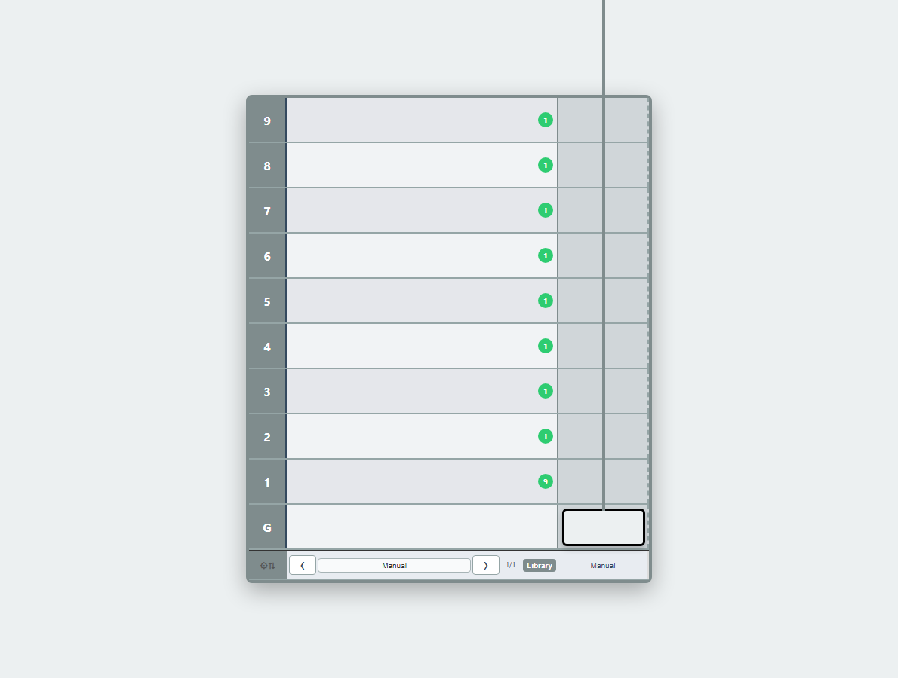
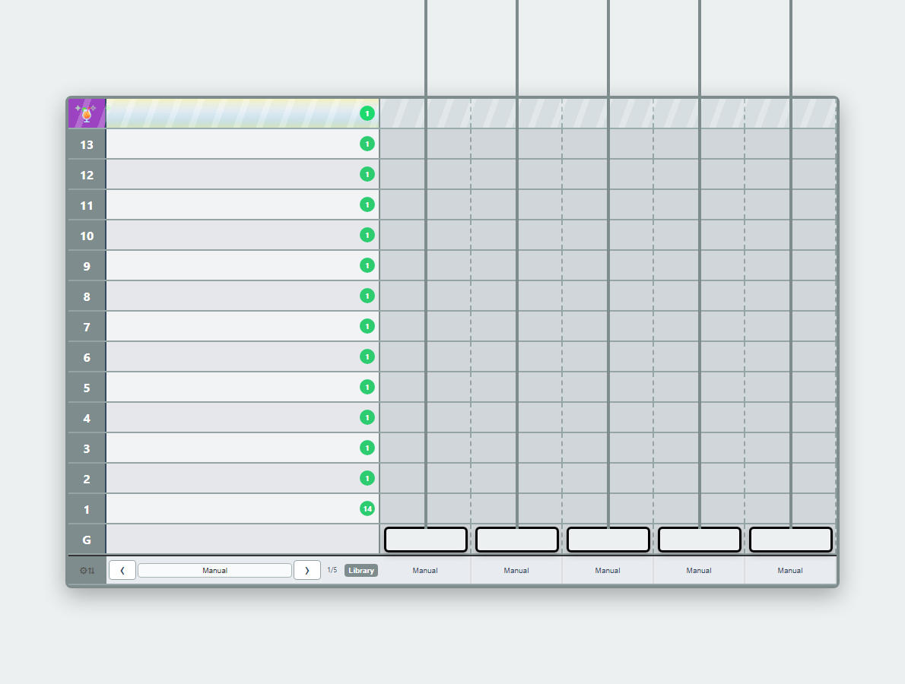
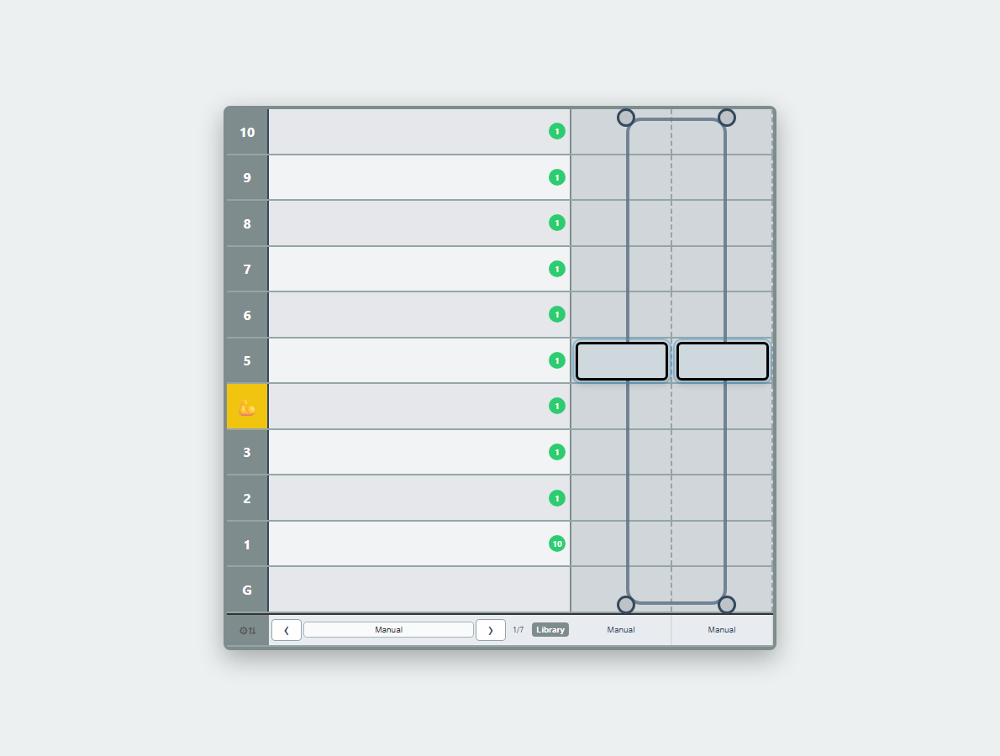
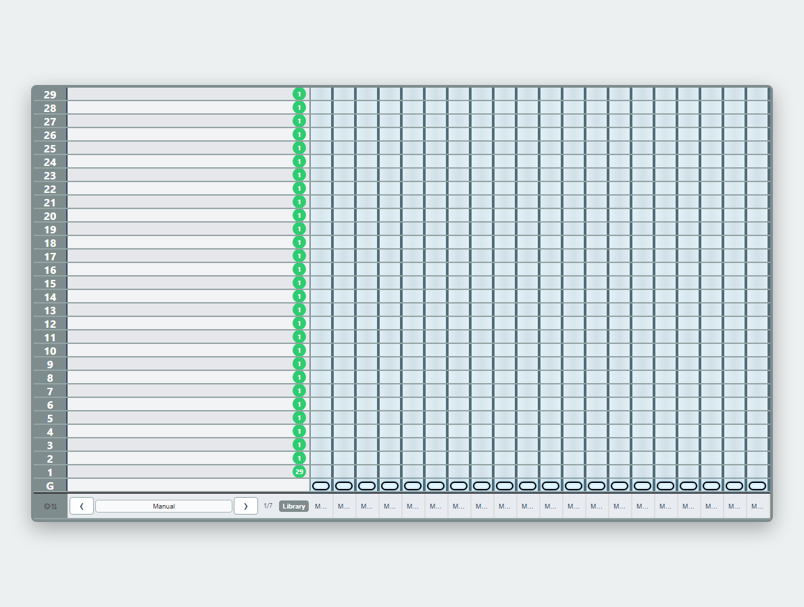

# Lift Operator

**Keep the hotel moving: route a growing lift fleet, automate the pressure, and solve each chaotic shift.**

## [▶ Play Now — GitHub Pages](https://gregorycwhill.github.io/Lift-Operator/)

**Status:** RC1.0 desktop playtest · 25-round campaign · best in current Chrome or Edge on a desktop/laptop.

| First shift | Rooftop pressure |
| --- | --- |
|  |  |
| Learn direct control, guests, and the first automation. | Keep ordinary traffic moving while the party pulls guests upstairs. |

| Counterweight puzzle | Capsule dispatch |
| --- | --- |
|  |  |
| Paired cars move in opposition; Open Plan becomes a lifeline. | Twenty single-passenger capsules reward smart automation over frantic clicking. |

## What’s in the campaign

- Fast, readable lift dispatch that grows into fleet-management puzzles.
- Built-in and Workshop-authored automations, including Service Zoning.
- Power-ups, VIP journeys, Checkout demand, Rooftop Parties, counterweights, and capsule tubes.
- Persistent Credits and deterministic seeds for repeatable problem-solving.
- Audio controls, attributions, Settings, and an in-game feedback action that copies diagnostics locally before opening a form.

## Help improve it

- Use **Give Feedback** in Settings or Round Review. It copies a compact diagnostic string to your clipboard, then opens
  the feedback destination. No diagnostic data is sent automatically.
- For structured reports, use the [GitHub Issue Forms](https://github.com/gregorycwhill/Lift-Operator/issues/new/choose):
  [bug](https://github.com/gregorycwhill/Lift-Operator/issues/new?template=bug.yml),
  [round/balance](https://github.com/gregorycwhill/Lift-Operator/issues/new?template=round-balance.yml), or
  [accessibility/device](https://github.com/gregorycwhill/Lift-Operator/issues/new?template=accessibility-device.yml).
- See the concise [RC1 Playtest Pack](docs/playtest/RC1_PLAYTEST_PACK.md) for current priorities and a report template.

## Contributors and project documentation

Lift Operator is a hobby project designed to help children move from Scratch into purposeful programming. The current
release work is correctness, performance, balance, usability, and device acceptance—not feature expansion. Start with
[DOCUMENTATION.md](DOCUMENTATION.md) for document roles, then see [THIRD_PARTY_NOTICES.md](THIRD_PARTY_NOTICES.md)
before redistributing a build.

| Need | Document |
| --- | --- |
| Product direction and sequence | [ROADMAP.md](ROADMAP.md) |
| Current implementation/release scope | [DELIVERY_PLAN.md](DELIVERY_PLAN.md) |
| Current evidence and release gates | [TEST_PLAN.md](TEST_PLAN.md) |
| Durable product rules | [GDD](Lift-Operator_GDD.md), [Game Play Map](Game%20Play%20Map.md), [Game Economy](Game%20Economy.md) |
| Workshop and Automation Dock contract | [Automation Workshop specification](Automation_Workshop_Spec.md) |
| Current playtest intake | [Feedback log](docs/playtest/PLAYTEST_FEEDBACK_LOG.md) |
| Material chat decisions | [Chat decision log](docs/CHAT_DECISION_LOG.md) |
| Audio source and credit record | [Audio attribution](assets/audio/ATTRIBUTION.md) |

## Local development

Requirements: Node.js 24 or a current supported LTS release, npm, and Playwright Chromium (install once with
`npx.cmd playwright install chromium`).

```powershell
npm.cmd install
npm.cmd run serve
```

Open `http://127.0.0.1:5500/` for local play. Use `npm.cmd run test:smoke` for a fast gate and
`npm.cmd run test:full` for the supported comprehensive suite.

After changing `design/game-balance.v1.json`, run:

```powershell
npm.cmd run balance:generate
npm.cmd run balance:check
```

Create screenshots and a social-preview image with `npm.cmd run capture:media`. Create a local itch.io-compatible ZIP
from the current commit with `npm.cmd run package:itch`.

## Security philosophy

The source is intentionally inspectable. Lift Operator protects the experience from accidents, not from curious
players: malformed payloads and broken scripts fail safely, while Workshop scripts run through bounded containment.
Strong authentication, anti-cheat, and adversarial source protection are not product goals.
